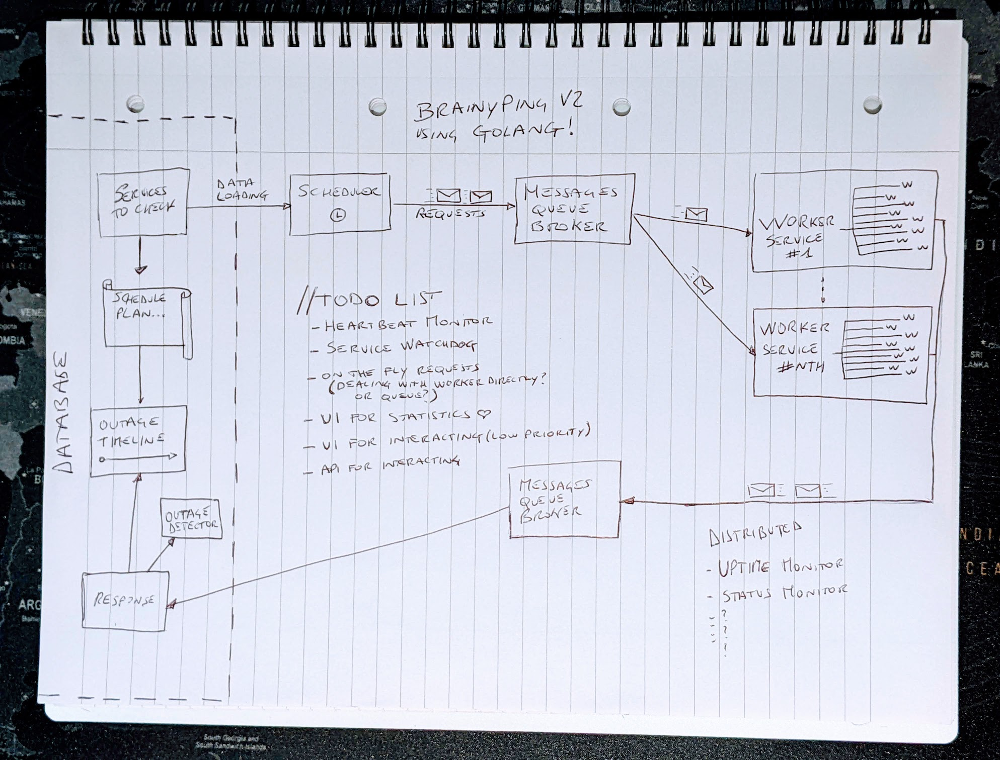
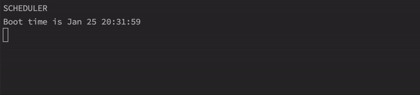
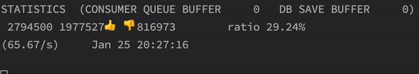

<H1>BRAINYPING V2</H1>
GOLANG IMPLEMENTATION

A distributed uptime and status monitor.

How it started... 

How it is going...  

SCHEDULER BOOT 

  
WORKER IN ACTION WITH LOCAL STATISTICS ENABLED 

  
RESPONSES CONSUMED FROM MESSAGE BROKER AND SAVED TO DB 

  
      

<i>
Powered by 🍝 Made with original italian ingredients
</i>

